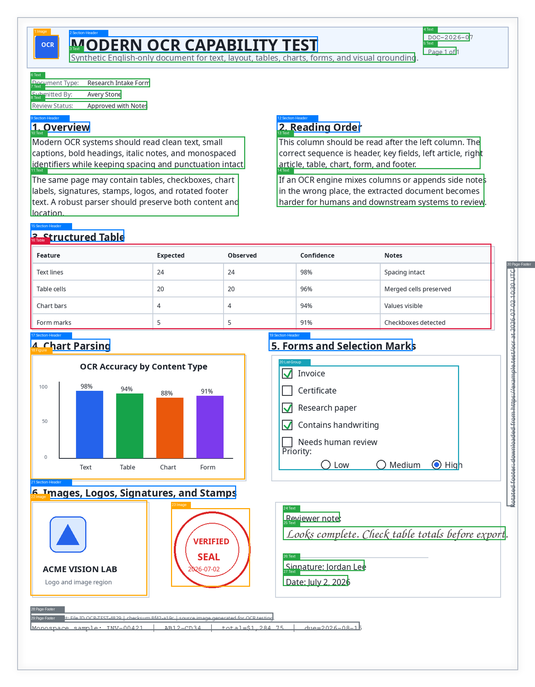
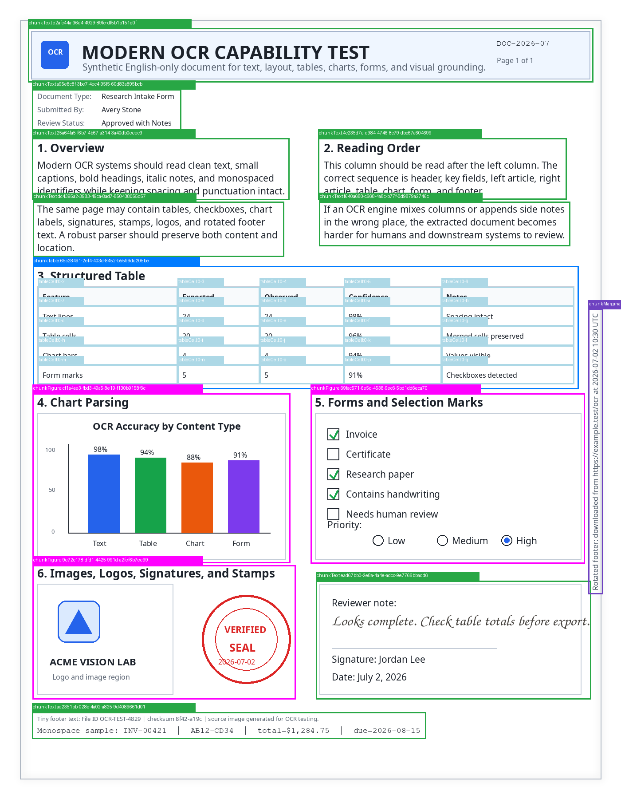
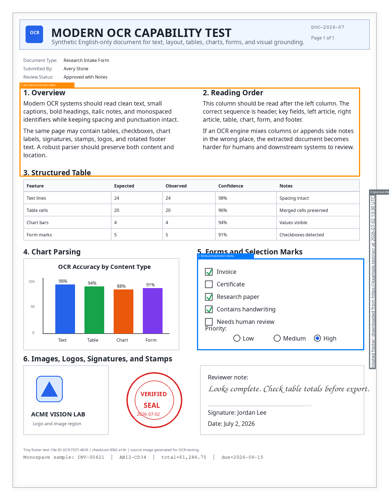
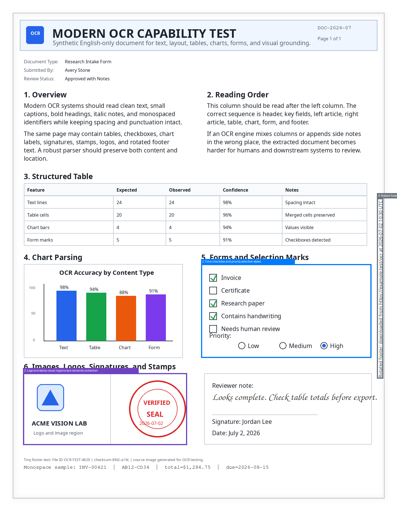

# Modern OCR


Modern OCR systems are no longer just text recognizers; they are document
understanding systems. A useful OCR pipeline should preserve the document's
text, structure, visual grounding, and meaning in a form that downstream tools
can use and humans can review.

This project compares recent open-source and cloud OCR systems on the same set
of documents, then evaluates how well each one preserves the document's text,
structure, reading order, visual grounding, and structured data.

## OCR Features

- **Text recognition**: Handles different fonts, sizes, languages, orientations,
  and document quality levels.
- **Reading order**: Preserves the natural flow of multi-column and complex
  documents.
- **Layout understanding**: Detects titles, headings, paragraphs, lists,
  captions, headers, footers, marginalia, and page numbers.
- **Tables and forms**: Preserves rows, columns, merged cells, form fields,
  checkboxes, radio buttons, and selected marks.
- **Key-value extraction**: Extracts structured fields from invoices, receipts,
  IDs, certificates, forms, and similar documents.
- **Charts and figures**: Extracts chart titles, labels, legends, values, units,
  figures, images, logos, and visual meaning.
- **Handwriting and symbols**: Handles handwritten text, formulas, equations,
  and scientific notation where supported.
- **Seals and attestations**: Detects stamps, seals, signatures, attestations,
  and official document markings.
- **Visual grounding**: Returns bounding boxes, coordinates, layout regions,
  confidence scores, or overlays linked to the source page.
- **Flexible input and output**: Handles PDFs, images, scans, Word-style
  documents, and outputs Markdown, HTML, JSON, or structured text.
- **Custom extraction**: Supports schema-based extraction, custom prompts,
  document classification, and task-specific parsing.
- **Robustness**: Handles low-quality scans, blur, skew, rotation, shadows,
  compression artifacts, multi-page documents, and repeated headers or footers.

## Requirements

- Linux x86_64
- Python 3.10 to 3.13
- `uv`
- CUDA-compatible GPU setup for `paddlepaddle-gpu==3.3.1`

## Install

Install the project dependencies:

```bash
uv sync
```

## API Keys

Set only the keys for the OCR providers you plan to run:

```bash
export OPENAI_API_KEY="..."
export LLAMA_CLOUD_API_KEY="..."
export MISTRAL_API_KEY="..."
export VISION_AGENT_API_KEY="..."
```

## Run OCR

Generate OCR outputs for the configured parsers. If no document path is passed,
`ocr_models.py` uses `input/modern_ocr_test.png`.

```bash
# default input document
uv run python ocr_models.py

# custom input document
uv run python ocr_models.py input/virology_pg2.pdf
```

Outputs are written under `output/<parser_name>/`, for example
`output/paddleocr/readable_output.md` and `output/paddleocr/full_detail.json`.

Example OCR overlay outputs:

| Chandra OCR 2 | LandingAI |
| --- | --- |
|  |  |

## Run Evaluation

The evaluation step compares each saved OCR result against the original input
document. For each model, it reads the raw detail file, the human-readable
output, and any layout overlay image, then scores how faithfully the OCR
preserves the document.

The evaluator looks for practical OCR issues: missing or incorrect text,
broken key-value fields, weak table extraction, lost checkbox or radio-button
states, skipped logos or stamps, wrong reading order, poor visual grounding,
and hallucinated or noisy text.

```bash
# all outputs
uv run python ocr_eval.py all

# selected outputs
uv run python ocr_eval.py paddleocr llamacloud mistralocr

# custom CSV path
uv run python ocr_eval.py all --output output/openai_eval/results.csv
```

The main result is `output/openai_eval/results.csv`, which contains per-model
scores and short issue notes. When an issue can be located on the page, the
evaluator also writes issue overlay images in the same directory so the problem
can be inspected visually.

Example issue overlays from the weakest current runs:

| PaddleOCR PPStructureV3 | Mistral OCR |
| --- | --- |
|  |  |

## References

- **PaddleOCR v6**: [PaddleOCR Github](https://github.com/PaddlePaddle/PaddleOCR)
- **NuExtract 3**: [NuExtract3 Huggingface](https://huggingface.co/numind/NuExtract3)
- **Chandra OCR 2**: [Chandra OCR 2 Huggingface](https://huggingface.co/datalab-to/chandra-ocr-2)
- **LandingAI ADE**: [LandingAI Documentation](https://docs.landing.ai/ade/ade-overview)
- **LlamaIndex**: [LlamaParse Documentation](https://developers.llamaindex.ai/llamaparse/parse/getting_started/)
- **Mistral OCR v4**: [Mistral Documentation](https://docs.mistral.ai/studio-api/document-processing/overview)
